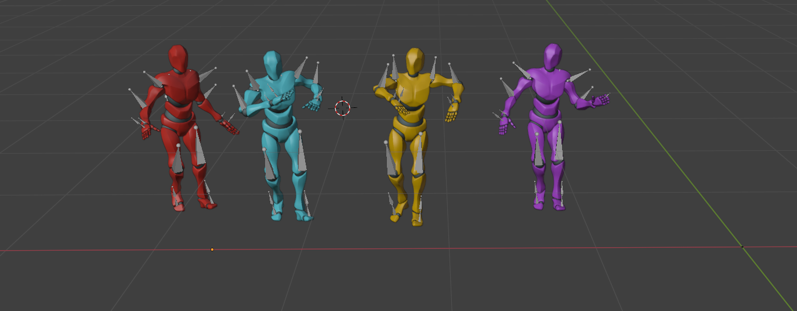

# Harmonious Group Choreography with Trajectory-Controllable Diffusion
Code for AAAI 2025 (oral) paper "Harmonious Group Choreography with Trajectory-Controllable Diffusion"

<!-- [<a href="https://wanluzhu.github.io/TCDiffusion/"><strong>Project Page</strong></a>]
[<a href="https://arxiv.org/pdf/2403.06189"><strong>Paper</strong></a>] -->

<!-- 
Our framework consists of two main components: the Dance-Beat Navigator (DBN) and Trajectory-Controllable Diffusion (TCDiff). 
To address dancer ambiguity, initially, we employ DBN to model dancer positions, as dancers' coordinates exhibit distinct differences and are less prone to confusion.
Subsequently, TCDiff utilizes this result for conditional diffusion to generate corresponding dance movements. During this process, a fusion projection enhances group information before inputting it into the multi-dance transformer, while a footwork adaptor adjusts the final footwork. -->

<p align="center">
  <em>✨ If you find this project useful, a ⭐️ would make our day! ✨.</em>
</p>

<p align="center">
  
</p>

<p align="center">
  <a href="https://arxiv.org/pdf/2403.06189">
    
  </a>
  <a href="https://wanluzhu.github.io/TCDiffusion/">
    
  </a>
  <a href="https://da1yuqin.github.io/TCDiffpp.website/">
    
  </a>
</p>


## Environment Setup

To set up the environment, follow these steps:

```bash
# Create a new conda environment
conda create -n tcdiff python=3.9
conda activate tcdiff

# Install PyTorch with CUDA support
conda install pytorch==2.0.0 torchvision==0.15.0 torchaudio==2.0.0 pytorch-cuda=11.7 -c pytorch -c nvidia

# Configure and install PyTorch3D
conda config --add channels https://mirrors.tuna.tsinghua.edu.cn/anaconda/cloud/pytorch3d/
conda install -c fvcore -c iopath -c conda-forge fvcore iopath 
conda install pytorch3d

# Install remaining requirements
pip install -r requirements.txt
```


# Data Preprocess
1. Please download AIOZ-GDance from [here](https://github.com/aioz-ai/AIOZ-GDANCE) and place it in the `./data/AIOZ_Dataset` path.


2. Run the Preprocessing Script:
```bash
cd data/
python create_dataset.py
```

# Training
Train the model using the following commands:
```bash
  CUDA_VISIBLE_DEVICES=1,2,3 accelerate launch train.py
```
- During training, the code produces a minimalistic stick figure representation to help visualize model performance. As shown below.

<table>
  <tr>
    <td>
      <center>
        
      </center>
    </td>
    <td>
      <center>
        
      </center>
    </td>
  </tr>
</table>


```bash
  cd TrajDecoder
  python train_traj.py --device cuda:0
```
- Similarly, when training trajectories using the Dance-Beat Navigator (DBN) module, a trajectory video will be generated. As shown below.


<table>
  <tr>
    <td>
      <center>
        
      </center>
    </td>
    <td>
      <center>
        
      </center>
    </td>
  </tr>
</table>


- Note: All videos play muted by default, click the volume icon to unmute. If videos fail to play due to network issues, please refer to the files in the `/assets` folder: `vis1.mp4, vis2.mp4, traj1.mp4, traj2.mp4`.

# Generate results
Our codebase provides two evaluation modes for generating results with the trained model:

- Validation Without Trajectory Model
```bash
python train.py --mode "val_without_TrajModel" 
```
When the trajectory model is not yet fully trained, this mode uses trajectories directly from the dataset for testing purposes. Both training and test splits are included to assess overall performance without introducing errors from an incomplete trajectory model.

- Testing with Generated Trajectories
```bash
python train.py --mode "test" 
```
These options allow flexible benchmarking of the model during different stages of development, ensuring both partial and full-pipeline evaluations.

# Visulization in Blender
We developed automated scripts to transform the generated SMPL motion data into beautiful 3D animations rendered in Blender, replicating the high-quality visuals featured on our project page. The entire rendering pipeline, from data preparation to Blender rendering, is fully scripted for ease of use and reproducibility. For detailed steps, please refer to the `Blender_Visulization/` Rendering Pipeline documentation.  ✨ Your star is the greatest encouragement for our work. ✨



## Acknowledgment
The concept of TCDiff is inspired by solo-dancer generation model [EDGE](https://github.com/Stanford-TML/EDGE).
We sincerely appreciate the efforts of these teams for their contributions to open-source research and development.

## Contributing
Heartfelt thanks to my amazing collaborator for making this project shine! 💡💪🌟
<table>
  <tbody>
    <tr>
    <td align="center" width="150">
        <a href="https://github.com/wanluzhu">
          
        </a>
        <div><strong>Wanlu Zhu</strong></div>
        <div>🏸💧🐈‍⬛</div>
      </td>
    </tr>
  </tbody>
</table>


# Citation
We present [TCDiff++](https://github.com/Da1yuqin/TCDiffpp), an end-to-end extension of TCDiff with improved long-term generation performance and simplified training (also converges faster). Stay tuned!
```
@article{dai2025tcdiff++,
  title={TCDiff++: An End-to-end Trajectory-Controllable Diffusion Model for Harmonious Music-Driven Group Choreography},
  author={Dai, Yuqin and Zhu, Wanlu and Li, Ronghui and Li, Xiu and Zhang, Zhenyu and Li, Jun and Yang, Jian},
  journal={arXiv preprint arXiv:2506.18671},
  year={2025}
}
@inproceedings{dai2025harmonious,
  title={Harmonious Music-driven Group Choreography with Trajectory-Controllable Diffusion},
  author={Dai, Yuqin and Zhu, Wanlu and Li, Ronghui and Ren, Zeping and Zhou, Xiangzheng and Ying, Jixuan and Li, Jun and Yang, Jian},
  booktitle={Proceedings of the AAAI Conference on Artificial Intelligence},
  volume={39},
  number={3},
  pages={2645--2653},
  year={2025}
}
```
